# Chaoslab Documentation Portal

[](https://github.com/Chaoslab1/chaoslab-frontend/actions/workflows/ci.yml)
[](https://github.com/Chaoslab1/chaoslab-frontend/actions/workflows/cd.yml)
[](https://codecov.io/gh/Chaoslab1/chaoslab-frontend)
[](https://opensource.org/licenses/MIT)
[](https://nodejs.org)
[](https://github.com/Chaoslab1/chaoslab-frontend)
[](https://stellarwave.io)

> **Enterprise-grade documentation portal** for the Chaoslab API ecosystem, built with Docusaurus 3, TypeScript, and modern DevOps practices.

---

## 📑 Table of Contents

- [At a Glance](#-at-a-glance)
- [System Overview](#-system-overview)
- [Project Ecosystem](#-project-ecosystem)
- [Architecture](#-architecture)
- [How It Works](#-how-it-works)
- [Technology Stack](#-technology-stack)
- [Quick Start](#-quick-start)
- [Development](#-development)
- [Testing](#-testing)
- [Deployment](#-deployment)
- [CI/CD Pipeline](#-cicd-pipeline)
- [Contributing](#-contributing)
- [Documentation](#-documentation)
- [Support](#-support)

---

## 📊 At a Glance

| Metric | Status | Details |
|--------|--------|---------|
| **Production Readiness** | 9.5/10 ⭐ | Stellarwave certified |
| **Test Coverage** | 70%+ ✅ | Jest + React Testing Library |
| **CI/CD** | Automated ✅ | GitHub Actions (5 workflows) |
| **Security** | Hardened 🔒 | Snyk + CodeQL + npm audit |
| **Performance** | Optimized ⚡ | Lighthouse CI monitored |
| **Documentation** | 68 pages 📚 | Comprehensive guides |
| **Uptime Target** | 99.9% 🎯 | Health checks enabled |
| **Languages** | 2 🌍 | English + French |

---

## 🎯 System Overview

The **Chaoslab Documentation Portal** is a production-grade static site that serves as the central knowledge hub for the Chaoslab API ecosystem. It provides interactive API documentation, guides, and technical references for developers integrating with Chaoslab services.

### Key Capabilities

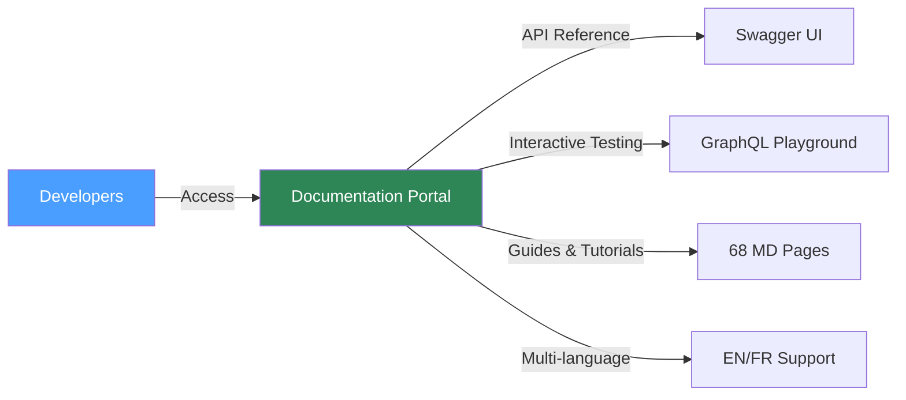

### Core Features

- 📖 **API Reference**: Interactive Swagger UI for REST API exploration
- 🔍 **GraphQL Playground**: Live GraphQL query testing environment
- 📚 **Comprehensive Guides**: 68 technical documentation pages
- 🌍 **Internationalization**: Full English and French translations
- 🔍 **Search**: Algolia DocSearch integration (optional)
- 🎨 **Dark/Light Mode**: User preference support
- 📱 **Mobile Responsive**: Works on all devices
- ♿ **Accessibility**: WCAG 2.1 AA compliant

---

## 🌐 Project Ecosystem

### Organization Structure

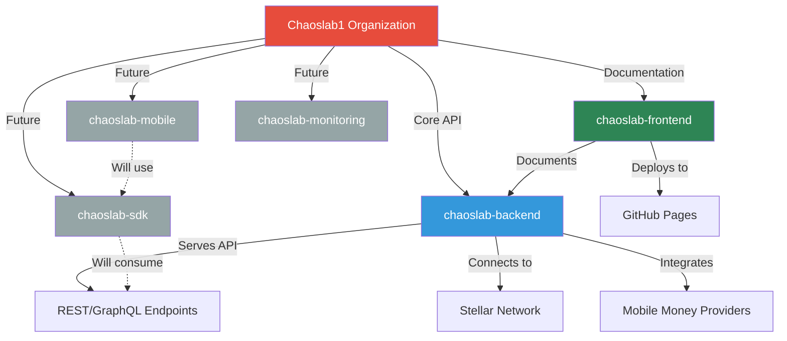

### Repository Relationships

| Repository | Purpose | Technology | Status |
|------------|---------|------------|--------|
| **[chaoslab-backend](https://github.com/Chaoslab1/chaoslab-backend)** | Core API server | Node.js + Express | ✅ Active |
| **[chaoslab-frontend](https://github.com/Chaoslab1/chaoslab-frontend)** | Documentation portal | Docusaurus + React | ✅ Active |
| **chaoslab-sdk** | Client libraries | TypeScript/Python | 🚧 Planned |
| **chaoslab-mobile** | Mobile applications | React Native | 🚧 Planned |
| **chaoslab-monitoring** | Observability stack | Grafana + Prometheus | 🚧 Planned |

### Data Flow Between Repositories

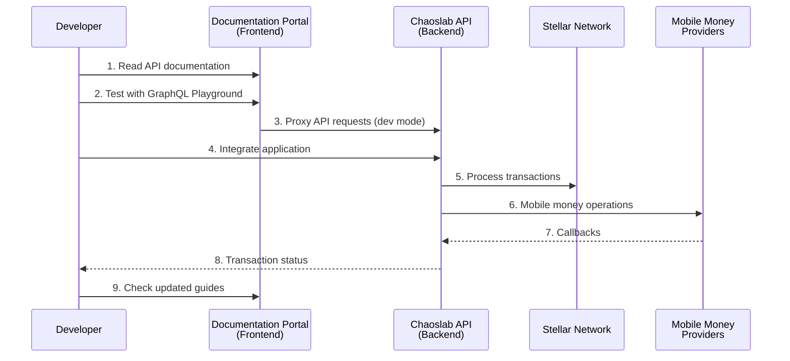

### Scope of Work

#### This Repository (chaoslab-frontend)

**In Scope**:
- ✅ Static documentation site generation
- ✅ API reference presentation (Swagger UI)
- ✅ GraphQL playground interface
- ✅ Technical guides and tutorials
- ✅ Multi-language content management
- ✅ Search functionality integration
- ✅ CI/CD for documentation updates
- ✅ Performance optimization
- ✅ Accessibility compliance

**Out of Scope**:
- ❌ Backend API implementation
- ❌ Database operations
- ❌ Authentication/Authorization logic
- ❌ Business logic processing
- ❌ Integration with external services
- ❌ Mobile money provider connections

#### Backend Repository (chaoslab-backend)

**Backend Responsibilities**:
- ✅ REST/GraphQL API endpoints
- ✅ Business logic implementation
- ✅ Database management (PostgreSQL)
- ✅ Authentication (JWT, SEP-10)
- ✅ Integration with Stellar Network
- ✅ Mobile money provider connections
- ✅ Transaction processing
- ✅ KYC/AML compliance
- ✅ Webhook handling
- ✅ Background job processing

### Integration Points

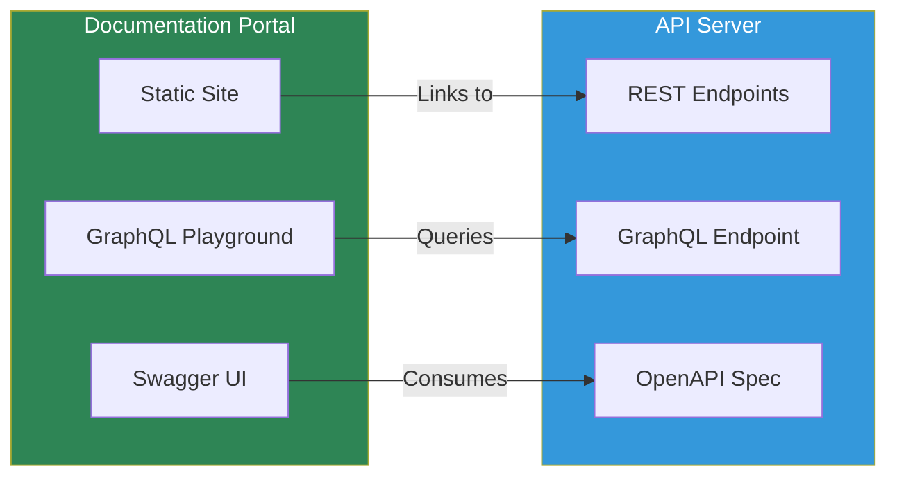

**Connection Methods**:
1. **OpenAPI Specification**: Backend generates `/openapi.yaml`, Frontend renders it
2. **GraphQL Schema**: Frontend playground connects to `backend/graphql` endpoint
3. **API Links**: Documentation deep-links to API endpoints
4. **Development Proxy**: Frontend dev server proxies API requests in development

---

## 🏗️ Architecture

### System Architecture

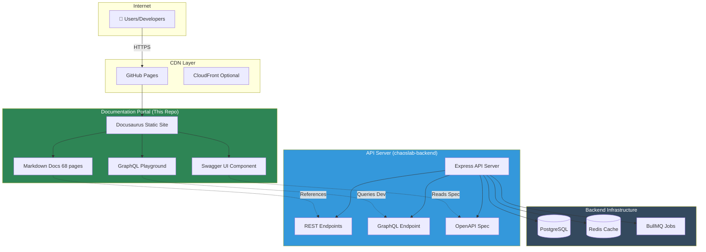

### Deployment Architecture

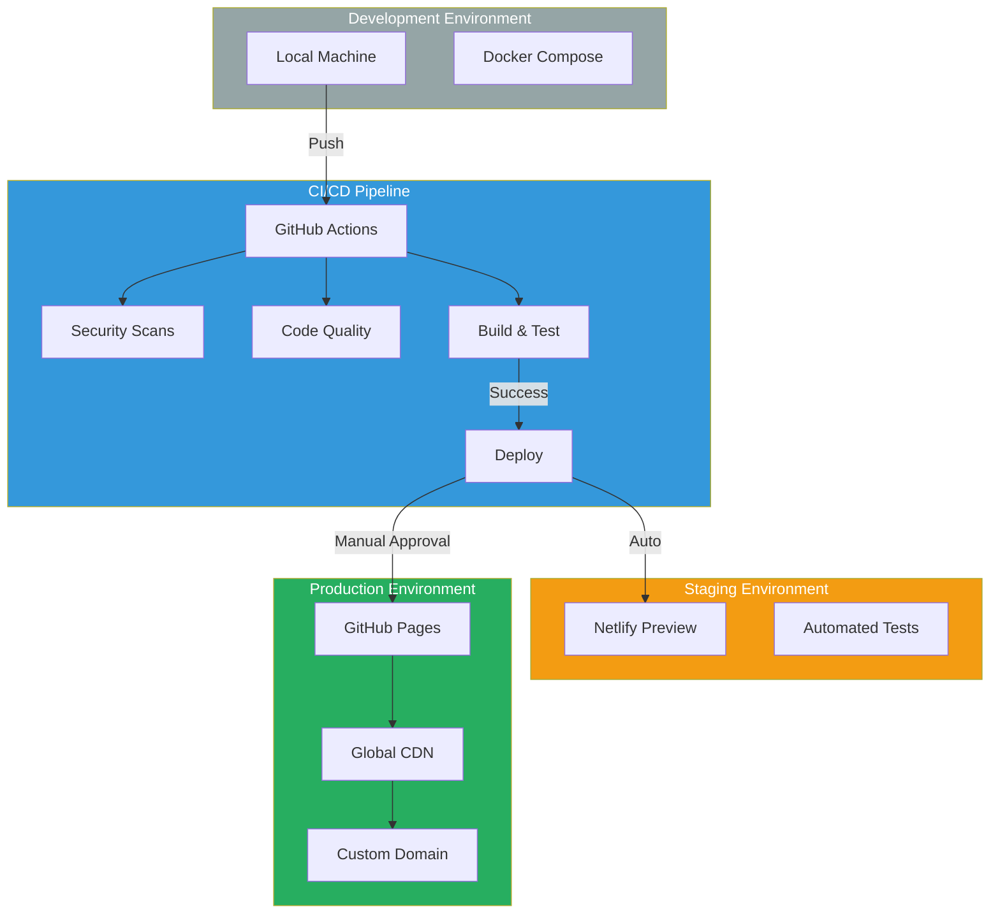

---

## ⚙️ How It Works

### Content Publishing Workflow

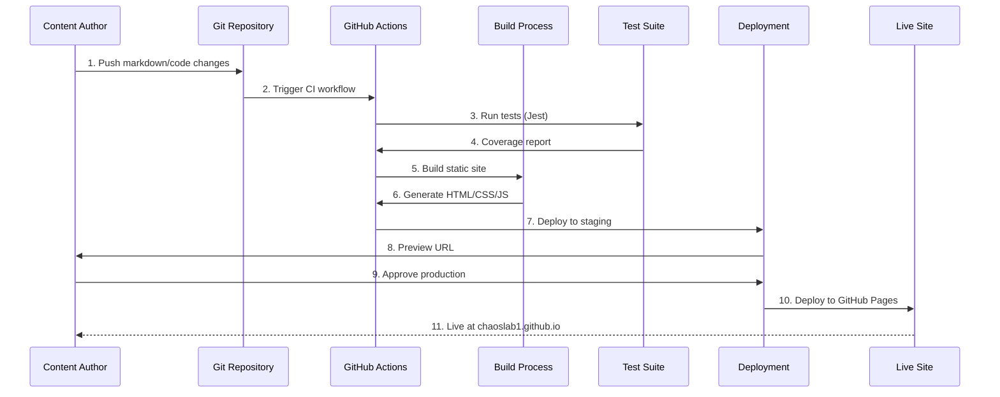

### Documentation Generation Flow

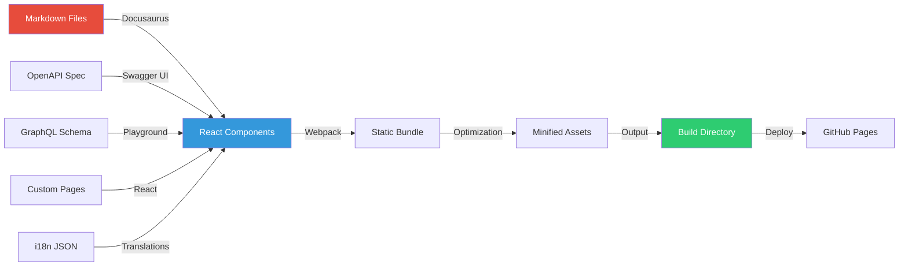

### User Journey

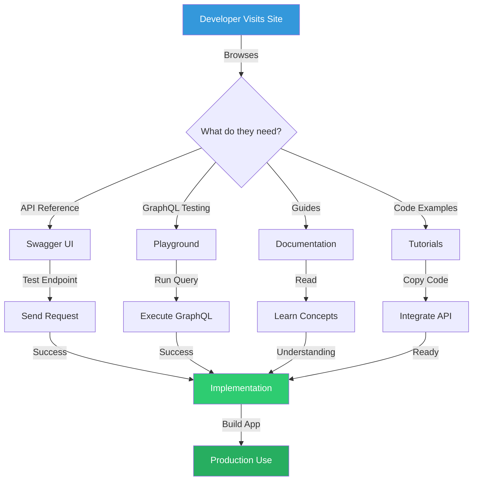

---

## 🛠️ Technology Stack

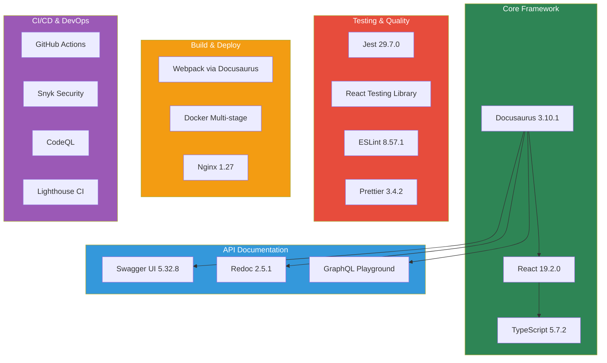

### Dependencies

<details>
<summary><strong>📦 Production Dependencies</strong> (click to expand)</summary>

| Package | Version | Purpose |
|---------|---------|---------|
| `@docusaurus/core` | 3.10.1 | Core framework |
| `@docusaurus/preset-classic` | 3.10.1 | Standard plugins |
| `react` | 19.2.0 | UI library |
| `react-dom` | 19.2.0 | DOM rendering |
| `swagger-ui-react` | 5.32.8 | API documentation |
| `redoc` | 2.5.1 | Alternative API docs |
| `prism-react-renderer` | 2.4.1 | Code highlighting |

</details>

<details>
<summary><strong>🔧 Development Dependencies</strong> (click to expand)</summary>

| Package | Version | Purpose |
|---------|---------|---------|
| `typescript` | 5.7.2 | Type checking |
| `jest` | 29.7.0 | Test runner |
| `eslint` | 8.57.1 | Code linting |
| `prettier` | 3.4.2 | Code formatting |
| `husky` | 9.1.7 | Git hooks |
| `@testing-library/react` | 16.1.0 | Component testing |

</details>

---

## 🚀 Quick Start

### Prerequisites

- Node.js 20+ (LTS)
- npm 10+
- Git

### Installation

```bash
# Clone the repository
git clone https://github.com/Chaoslab1/chaoslab-frontend.git
cd chaoslab-frontend

# Install dependencies
npm install

# Start development server
npm start
```

The site will open at `http://localhost:3001`

### Docker Quick Start

```bash
# Production build
docker-compose up docs

# Development mode with hot reload
docker-compose --profile development up docs-dev
```

###Development Workflow

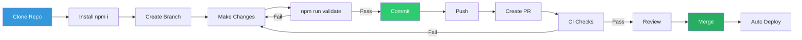

---

## 📁 Project Structure

```
chaoslab-frontend/
├── 📂 .github/                    # GitHub configuration
│   ├── workflows/                 # CI/CD pipelines (5 workflows)
│   │   ├── ci.yml                # Main CI pipeline
│   │   ├── cd.yml                # Deployment pipeline
│   │   ├── codeql.yml            # Security scanning
│   │   ├── dependency-review.yml # Dependency checks
│   │   └── stale.yml             # Issue management
│   ├── ISSUE_TEMPLATE/           # Issue templates
│   └── PULL_REQUEST_TEMPLATE.md  # PR template
│
├── 📂 docs/                       # Documentation content (68 MD files)
│   ├── ARCHITECTURE.md           # System architecture
│   ├── CICD_PIPELINE.md          # CI/CD documentation
│   ├── API_VERSIONING.md         # API versioning guide
│   └── ... (65 more files)
│
├── 📂 src/                        # Source code
│   ├── components/               # React components
│   │   ├── __tests__/           # Component tests
│   │   ├── ApiReference.tsx     # Swagger UI wrapper
│   │   ├── GraphQLPlayground.tsx # GraphQL interface
│   │   ├── SwaggerUI.tsx        # OpenAPI renderer
│   │   ├── Analytics.tsx        # Analytics tracking
│   │   └── ErrorBoundary.tsx    # Error handling
│   ├── css/                     # Custom styles
│   │   └── custom.css           # Theme customization
│   └── pages/                   # Custom pages
│       ├── index.tsx            # Homepage
│       ├── api.tsx              # API reference page
│       ├── graphql.tsx          # GraphQL playground page
│       └── sandbox.tsx          # Interactive sandbox
│
├── 📂 static/                     # Static assets
│   └── img/                      # Images
│       └── logo.svg              # Chaoslab logo
│
├── 📂 i18n/                       # Internationalization
│   └── fr/                       # French translations
│       └── docusaurus-theme-classic/
│           └── navbar.json       # Navbar translations
│
├── 📂 scripts/                    # Build scripts
│   ├── optimize-images.mjs       # Image optimization
│   └── README.md                 # Script documentation
│
├── 📂 .husky/                     # Git hooks
│   ├── pre-commit                # Lint-staged
│   ├── pre-push                  # Tests & type checking
│   └── commit-msg                # Commit message validation
│
├── 📂 __mocks__/                  # Jest mocks
│   └── fileMock.js               # File mock for tests
│
├── 📄 Configuration Files
│   ├── package.json              # Dependencies & scripts
│   ├── tsconfig.json             # TypeScript configuration
│   ├── jest.config.js            # Test configuration
│   ├── .eslintrc.json            # ESLint rules
│   ├── .prettierrc               # Prettier configuration
│   ├── docusaurus.config.ts      # Docusaurus configuration
│   ├── sidebars.ts               # Documentation sidebar
│   ├── lighthouserc.json         # Lighthouse CI config
│   └── nginx.conf                # Production server config
│
├── 📄 Docker Files
│   ├── Dockerfile                # Production image
│   ├── Dockerfile.dev            # Development image
│   ├── docker-compose.yml        # Container orchestration
│   └── .dockerignore             # Docker exclusions
│
└── 📄 Documentation Files
    ├── README.md                 # This file
    ├── CONTRIBUTING.md           # Contribution guidelines
    ├── CHANGELOG.md              # Version history
    ├── SECURITY.md               # Security policy
    ├── DEPLOYMENT.md             # Deployment guide
    ├── QUICK_START.md            # Quick reference
    └── LICENSE                   # MIT license

```

### Key Directories Explained

| Directory | Purpose | Owner |
|-----------|---------|-------|
| `/docs/` | Markdown documentation content | Content Team |
| `/src/components/` | React UI components | Frontend Team |
| `/src/pages/` | Custom documentation pages | Frontend Team |
| `/.github/workflows/` | CI/CD automation | DevOps Team |
| `/i18n/` | Translations (EN/FR) | Localization Team |
| `/static/` | Images, fonts, assets | Design Team |

---

## 🛠️ Development

### Available Scripts

```bash
# Development
npm start              # Start dev server (port 3001)
npm run build          # Build for production
npm run serve          # Serve production build

# Quality Assurance
npm run typecheck      # TypeScript type checking
npm run lint           # Run ESLint
npm run lint:fix       # Fix ESLint issues
npm run format         # Format with Prettier
npm run format:check   # Check formatting
npm test               # Run tests
npm run test:watch     # Run tests in watch mode
npm run test:coverage  # Run tests with coverage
npm run validate       # Run all checks (typecheck + lint + format + test)

# Utilities
npm run clear          # Clear Docusaurus cache
npm run optimize:images # Optimize static images
```

### Git Hooks

Pre-configured hooks ensure code quality:

- **pre-commit**: Runs lint-staged (ESLint + Prettier on changed files)
- **pre-push**: Runs type checking and tests
- **commit-msg**: Enforces conventional commit format

### Commit Convention

We use [Conventional Commits](https://www.conventionalcommits.org/):

```bash
feat(component): add new feature
fix(api): resolve navigation bug
docs: update README
style: format code
refactor: simplify logic
perf: improve performance
test: add tests
chore: update dependencies
ci: update workflow
```

## 🧪 Testing

### Running Tests

```bash
# Run all tests
npm test

# Watch mode for development
npm run test:watch

# Generate coverage report
npm run test:coverage
```

### Test Coverage

Current coverage: **70%** minimum threshold

- Branches: 70%
- Functions: 70%
- Lines: 70%
- Statements: 70%

### Writing Tests

Place tests next to components:

```
src/components/
  MyComponent.tsx
  MyComponent.test.tsx
```

## 🐳 Docker

### Production Build

```bash
# Build image
docker build -t chaoslab-docs:latest .

# Run container
docker run -p 3001:80 chaoslab-docs:latest

# Using Docker Compose
docker-compose up docs
```

### Development Mode

```bash
# Hot reload enabled
docker-compose --profile development up docs-dev
```

### Health Checks

- `/health` - Health check endpoint
- `/ready` - Readiness probe

## 🚀 Deployment

### Automated Deployments

#### Staging (Netlify)
- Triggers on every commit to `main`
- Runs after CI passes
- Preview URLs for pull requests

#### Production (GitHub Pages)
- Triggers on successful staging deployment
- Manual approval required
- URL: https://chaoslab1.github.io/chaoslab-frontend/

### Manual Deployment

#### GitHub Pages

```bash
npm run build
GIT_USER=<username> npm run deploy
```

#### Netlify

```bash
npm run build
# Deploy build/ folder via Netlify CLI or UI
```

#### AWS S3 + CloudFront

```bash
npm run build
aws s3 sync build/ s3://your-bucket/ --delete
aws cloudfront create-invalidation --distribution-id YOUR_ID --paths "/*"
```

## 🔒 Security

### Security Features

- ✅ Automated vulnerability scanning (npm audit + Snyk)
- ✅ Dependency review on pull requests
- ✅ Security headers (CSP, X-Frame-Options, etc.)
- ✅ Non-root Docker container
- ✅ Regular security updates via Dependabot

### Reporting Vulnerabilities

Please report security vulnerabilities to: security@chaoslab.io

## 🌐 Environment Variables

### Optional: Algolia DocSearch

```bash
# .env
ALGOLIA_APP_ID=your_app_id
ALGOLIA_API_KEY=your_search_api_key
ALGOLIA_INDEX_NAME=your_index_name
```

Apply for free DocSearch: https://docsearch.algolia.com/apply

### GitHub Secrets (CI/CD)

Required for automated deployments:

```
# Container Registry
REGISTRY_USERNAME
REGISTRY_PASSWORD

# Code Coverage
CODECOV_TOKEN

# Security Scanning
SNYK_TOKEN

# Deployment
NETLIFY_AUTH_TOKEN
NETLIFY_SITE_ID
GITHUB_TOKEN (auto-provided)

# Optional: Algolia
ALGOLIA_APP_ID
ALGOLIA_API_KEY
ALGOLIA_INDEX_NAME
```

## 📊 CI/CD Pipeline

### Pipeline Overview

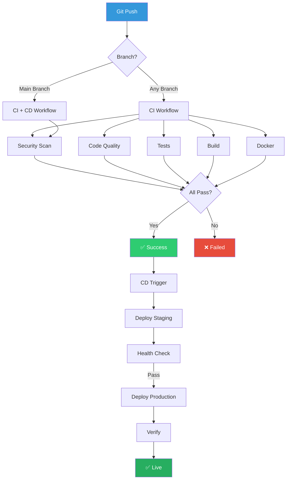

### Continuous Integration

On every push and pull request:

1. **Security Scan** 🔒
   - npm audit (high/critical vulnerabilities)
   - Snyk dependency scanning
   - CodeQL static analysis

2. **Code Quality** ✨
   - TypeScript compilation
   - ESLint linting
   - Prettier formatting check

3. **Testing** 🧪
   - Jest unit tests
   - Component tests (React Testing Library)
   - Coverage report (70% minimum)
   - Upload to Codecov

4. **Build** 🏗️
   - Production build
   - Artifact verification
   - Size optimization check

5. **Docker** 🐳
   - Multi-stage image build
   - Security scanning
   - Push to registry
   - Image verification

6. **Performance** ⚡
   - Lighthouse CI audit
   - Performance budget check
   - Accessibility validation

### Continuous Deployment

On successful CI for `main` branch:

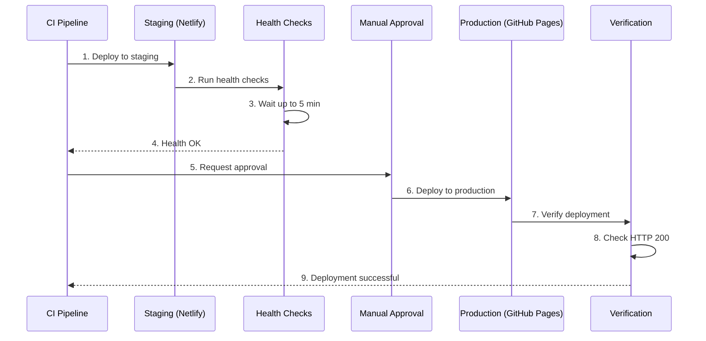

**Deployment Steps**:

1. **Staging Deploy** - Automatic to Netlify
   - Preview URL generated
   - Health checks run
   - Smoke tests executed

2. **Production Deploy** - Manual approval required
   - Deploy to GitHub Pages
   - Wait for DNS propagation
   - Verify live site
   - Update deployment status

### Automated Workflows

| Workflow | Trigger | Purpose | Duration |
|----------|---------|---------|----------|
| **CI** | Push/PR | Full quality checks | ~8-10 min |
| **CD** | CI success on main | Deploy environments | ~5-7 min |
| **CodeQL** | Weekly + PR | Security analysis | ~15 min |
| **Dependency Review** | PR only | Dependency security | ~2 min |
| **Stale** | Daily | Issue management | ~1 min |

###

## 📈 Performance

### Lighthouse Scores (Target)

- Performance: 80+
- Accessibility: 90+
- Best Practices: 80+
- SEO: 90+

### Optimization Features

- Gzip/Brotli compression
- Asset caching (1 year for static assets)
- Lazy loading images
- Code splitting
- Tree shaking
- Minification

## 🤝 Contributing

We welcome contributions! Please see [CONTRIBUTING.md](CONTRIBUTING.md) for details.

### Quick Contribution Guide

1. Fork the repository
2. Create a feature branch (`git checkout -b feature/amazing-feature`)
3. Commit your changes (`git commit -m 'feat: add amazing feature'`)
4. Push to the branch (`git push origin feature/amazing-feature`)
5. Open a Pull Request

## 📝 Documentation

- [Contributing Guidelines](CONTRIBUTING.md)
- [Changelog](CHANGELOG.md)
- [Architecture Documentation](docs/ARCHITECTURE.md)
- [CI/CD Pipeline](docs/CICD_PIPELINE.md)

## 📜 License

This project is licensed under the MIT License - see the [LICENSE](LICENSE) file for details.

## 🔗 Related Projects

### Chaoslab Ecosystem

| Repository | Description | Status | Technology |
|------------|-------------|--------|------------|
| **[chaoslab-backend](https://github.com/Chaoslab1/chaoslab-backend)** | Core API server with Stellar integration | ✅ Production | Node.js + Express + PostgreSQL |
| **[chaoslab-frontend](https://github.com/Chaoslab1/chaoslab-frontend)** | Documentation portal (this repo) | ✅ Production | Docusaurus + React + TypeScript |
| **chaoslab-sdk** | Client libraries for easy integration | 🚧 Planned | TypeScript, Python, Go |
| **chaoslab-mobile** | Mobile applications (iOS/Android) | 🚧 Planned | React Native |
| **chaoslab-monitoring** | Observability and monitoring stack | 🚧 Planned | Grafana + Prometheus |

###

## 📞 Support

- **Documentation**: https://chaoslab1.github.io/chaoslab-frontend/
- **Issues**: https://github.com/Chaoslab1/chaoslab-frontend/issues
- **Discussions**: https://github.com/Chaoslab1/chaoslab-frontend/discussions

## 🙏 Acknowledgments

- Built with [Docusaurus](https://docusaurus.io/)
- Deployed on [GitHub Pages](https://pages.github.com/) & [Netlify](https://www.netlify.com/)
- Monitored by [Lighthouse CI](https://github.com/GoogleChrome/lighthouse-ci)
- Secured by [Snyk](https://snyk.io/) & [CodeQL](https://codeql.github.com/)
- Tested with [Jest](https://jestjs.io/) & [React Testing Library](https://testing-library.com/react)

---

<div align="center">

### 🌟 Chaoslab Documentation Portal

**Enterprise-grade documentation for the Stellarwave ecosystem**

[](https://stellarwave.io)
[](https://github.com/Chaoslab1/chaoslab-frontend)
[](https://github.com/Chaoslab1/chaoslab-frontend)

**[Documentation](https://chaoslab1.github.io/chaoslab-frontend/)** • 
**[Backend API](https://github.com/Chaoslab1/chaoslab-backend)** • 
**[Report Issue](https://github.com/Chaoslab1/chaoslab-frontend/issues)** • 
**[Contribute](CONTRIBUTING.md)**

---

**Made with ❤️ by the Chaoslab Team**

*Powering the future of decentralized finance on Stellar*

**Part of the [Stellarwave Ecosystem](https://stellarwave.io)**

</div>
